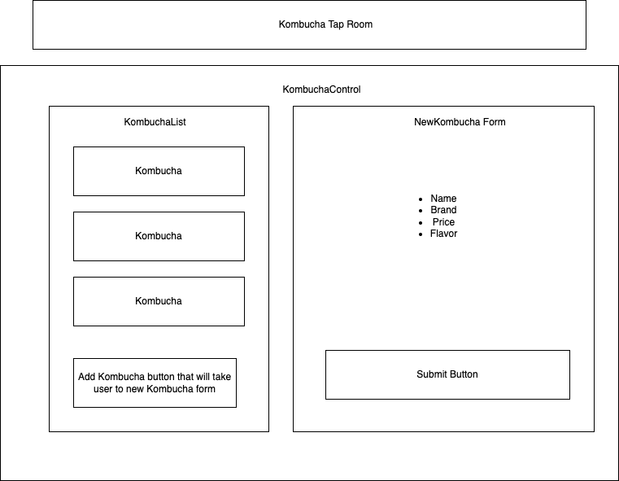

# Kombucha House

## React indepdendent project for Epicodus

## Created By: Anna Pittman

## Technologies Used
* _HTML_
* _CSS_
* _Javascript_
* _React_
* _npm_

## Description
This is an independent project, created at Epicodus to show proficiency in React Fundamentals. The application is for a kombucha brewery to list their various kombuchas with names, brands, flavors, prices, and quantities. The user has create and read functionality to each kombucha.

## Project Layout Diagram

## Setup/Installation Requirements
* React version 3.2.0

## Basic Setup
* Clone the GitHub repository: https://github.com/an12346/tap-room
* From the main project directory, run npm install in the terminal to load necessary plugins and packages.
* Run npm install --save-exact react-scripts@3.2.0 to install React version 3.2.0
* Run npm run start to start the application.

## Known Bugs
* Unable to view product details page

## License
MIT Copyright (c) 2022 Anna Pittman

## Contact Details:
annaepittman@gmail.com
